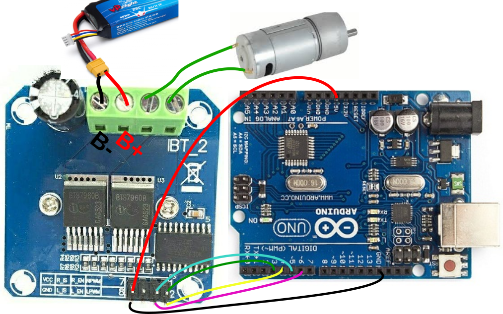

**Tutorial Menggunakan Modul Motor Driver BTS7960 dengan Arduino**

Modul motor driver BTS7960 adalah modul driver motor dengan kemampuan menangani arus tinggi yang cocok untuk motor DC. Tutorial ini akan menjelaskan cara menghubungkan dan mengontrol motor menggunakan Arduino.

### **Langkah 1: Koneksi Modul BTS7960 dengan Arduino**

Hubungkan pin pada modul BTS7960 sesuai dengan tabel berikut:

| **Pin Modul BTS7960** | **Koneksi ke Arduino**  |
| --------------------- | ----------------------- |
| VCC                   | 5V Arduino              |
| GND                   | GND Arduino             |
| R_EN                  | D5                      |
| L_EN                  | D6                      |
| RPWM                  | D3                      |
| LPWM                  | D4                      |
| R_IS                  | Tidak perlu dihubungkan |
| L_IS                  | Tidak perlu dihubungkan |

> [!WARNING]
>
> Perhatikan koneksi B+ dan B- karena di internet banyak yang tidak sesuai dengan modul, perhatikan  label pada bagian belakang PCB bila perlu


### **Langkah 2: Persiapan Perangkat Lunak**

Gunakan kode berikut sebagai contoh program untuk mengontrol motor DC dengan modul BTS7960.

```c++
#include <Arduino.h>

int RPWM=3;
int LPWM=4;
int R_EN=5;
int L_EN=6;

void setup() {
  pinMode(RPWM,OUTPUT);
  pinMode(LPWM,OUTPUT);
  pinMode(R_EN,OUTPUT);
  pinMode(L_EN,OUTPUT);
  digitalWrite(R_EN,HIGH);
  digitalWrite(L_EN,HIGH);
}

void loop() {
//forward
  analogWrite(LPWM,255);
  analogWrite(RPWM,0);
  delay(1000);

//stop
  analogWrite(LPWM,0);
  analogWrite(RPWM,0);
delay(1000);

//reverse
  analogWrite(LPWM,0);
  analogWrite(RPWM,255);
  delay(1000);
//stop
  analogWrite(LPWM,0);
  analogWrite(RPWM,0);
  delay(1000);
}

```

### **Langkah 3: Penjelasan Program**

1. **Deklarasi Pin**
   Pin `RPWM` dan `LPWM` digunakan untuk sinyal PWM yang menentukan arah putaran motor. Pin `R_EN` dan `L_EN` digunakan untuk mengaktifkan driver.
2. **Setup**
   Semua pin diinisialisasi sebagai output, dan `R_EN` serta `L_EN` diatur ke `HIGH` untuk mengaktifkan driver.
3. **Loop**
   - **Gerak Maju**: Motor bergerak maju dengan memberikan nilai PWM penuh pada `LPWM` dan `0` pada `RPWM`.
   - **Stop**: Motor dihentikan dengan memberikan nilai PWM `0` pada kedua pin.
   - **Gerak Mundur**: Motor bergerak mundur dengan memberikan nilai PWM penuh pada `RPWM` dan `0` pada `LPWM`.

### **Langkah 4: Uji Coba Program 

1. Sambungkan modul BTS7960 ke motor DC dan Arduino sesuai diagram di atas.
2. Upload kode ke Arduino melalui Arduino IDE.
3. Perhatikan gerakan motor:
   - Bergerak maju selama 1 detik.
   - Berhenti selama 1 detik.
   - Bergerak mundur selama 1 detik.
   - Berhenti selama 1 detik.

Semoga berhasil! Jika ada pertanyaan atau kendala, jangan ragu untuk bertanya. 😊

------

Dengan tutorial ini, Anda seharusnya dapat mengendalikan motor DC menggunakan modul BTS7960 dan Arduino. Selamat mencoba! 😊